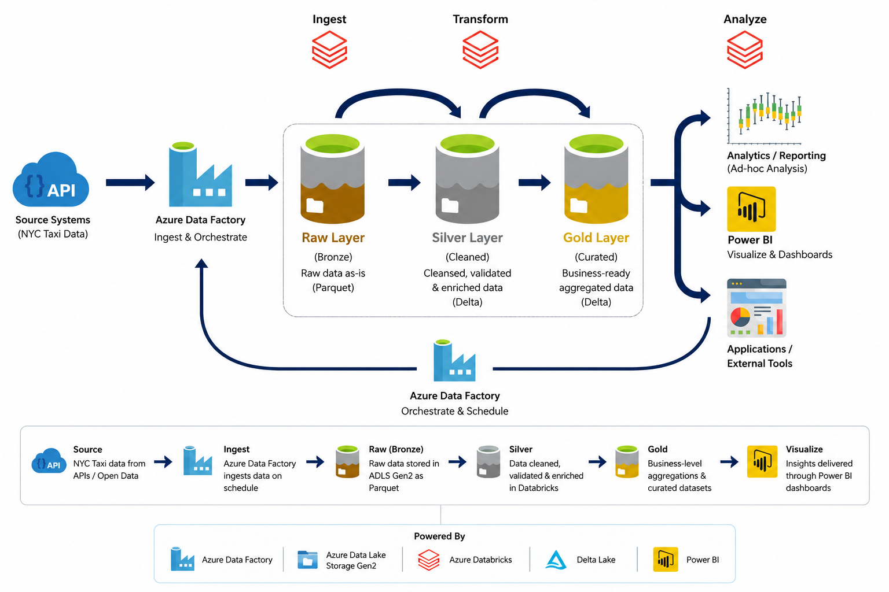
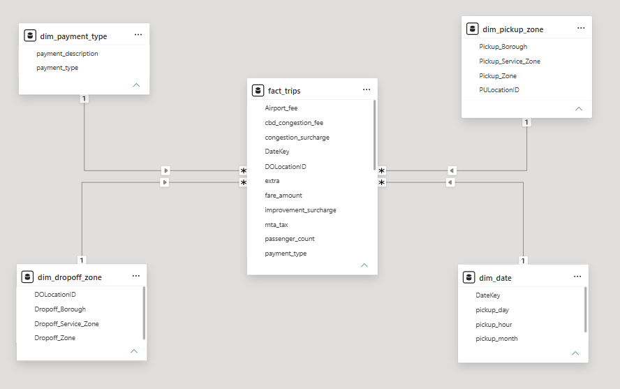

<div align="center">

# 🚖 NYC Yellow Taxi — Azure Data Engineering Pipeline

[](https://azure.microsoft.com)
[](https://databricks.com)
[](https://delta.io)
[](https://powerbi.microsoft.com)
[](https://github.com/TejasML/azure-data-engineering-pipeline)

**End-to-end cloud data engineering pipeline processing 30M+ NYC Yellow Taxi trip records using a fully automated, metadata-driven Medallion Architecture on Azure.**

</div>

---

## 📌 Table of Contents

- [Overview](#-overview)
- [Architecture](#️-architecture)
- [Tech Stack](#️-tech-stack)
- [Pipeline Walkthrough](#-pipeline-walkthrough)
  - [1. Metadata-Driven Ingestion (ADF)](#1-metadata-driven-ingestion-adf)
  - [2. Bronze Layer — Raw Ingestion](#2-bronze-layer--raw-ingestion)
  - [3. Silver Layer — Cleansing & Transformation](#3-silver-layer--cleansing--transformation)
  - [4. Gold Layer — Star Schema Modeling](#4-gold-layer--star-schema-modeling)
- [Infrastructure & Security](#-infrastructure--security)
- [Power BI Dashboard](#-power-bi-dashboard)
- [Project Structure](#-project-structure)
- [Cost Breakdown](#-cost-breakdown)
- [Key Outcomes](#-key-outcomes)
- [Future Enhancements](#-future-enhancements)

---

## 🗺 Overview

This project demonstrates a **production-grade Azure Data Engineering pipeline** built on real-world NYC Yellow Taxi Trip Records. The pipeline automates everything from raw data ingestion to analytical modeling — orchestrated by **Azure Data Factory** and processed through **Azure Databricks** with **Delta Lake** at every layer.

The architecture is **metadata-driven**: a lightweight JSON config controls which monthly datasets are ingested, meaning the pipeline scales to new months without a single code change.

**Dataset:** [NYC TLC Yellow Taxi Trip Records](https://www.nyc.gov/site/tlc/about/tlc-trip-record-data.page) — monthly Parquet files, **30M+ rows**

---

## 🏗️ Architecture

The pipeline follows the **Medallion Architecture** (Bronze → Silver → Gold) with Azure-native services at every layer.



```
┌──────────────────────────────────────────────────────────────────┐
│                         INGESTION (ADF)                          │
│                                                                  │
│   months.json ──► Lookup ──► ForEach ──► Copy Activity           │
│                                               │                  │
│                                               ▼                  │
│                                     ADLS Gen2 (raw-landing)      │
└───────────────────────────────────────────────┬──────────────────┘
                                                │
              ┌─────────────────────────────────▼──────────────────────────┐
              │              MEDALLION ARCHITECTURE (Databricks)            │
              │                                                             │
              │   Raw Landing ──► Bronze ──► Silver ──► Gold                │
              │                   (Delta)    (Delta)   (Star Schema)        │
              └──────────────────────────────────────────┬──────────────────┘
                                                         │
                              ┌──────────────────────────▼───┐
                              │   Databricks SQL Warehouse    │
                              │              │                │
                              │           Power BI            │
                              └───────────────────────────────┘
```

---

## ⚙️ Tech Stack

| Layer           | Technology                                   |
|-----------------|----------------------------------------------|
| Orchestration   | Azure Data Factory (ADF)                     |
| Storage         | Azure Data Lake Storage Gen2 (ADLS Gen2)     |
| Compute         | Azure Databricks (Runtime 17.3 LTS)          |
| Processing      | Apache Spark / PySpark                       |
| Table Format    | Delta Lake                                   |
| Security        | Azure Key Vault + Databricks Secret Scope    |
| Reporting       | Power BI (via Databricks SQL Warehouse)      |
| Version Control | GitHub                                       |
| Config Format   | JSON (metadata-driven)                       |

---

## 🔄 Pipeline Walkthrough

### 1. Metadata-Driven Ingestion (ADF)

Instead of hardcoding file paths, the pipeline reads a `months.json` config stored in ADLS Gen2. ADF dynamically resolves source URLs and downloads the corresponding NYC Taxi Parquet files — no code changes needed to onboard a new month.

```json
[
  { "year": "2024", "month": "01" },
  { "year": "2024", "month": "02" }
]
```


**ADF Pipeline Activities:**

| Step | Activity            | Description                                              |
|------|---------------------|----------------------------------------------------------|
| 1    | Lookup              | Reads `months.json` from ADLS Gen2                       |
| 2    | ForEach             | Iterates over each year/month entry                      |
| 3    | Copy Activity       | Downloads Parquet via HTTP; lands in `raw-landing`        |
| 4    | Databricks Bronze   | Triggers bronze ingestion notebook                       |
| 5    | Databricks Silver   | Triggers silver transformation notebook                  |
| 6    | Databricks Gold     | Triggers gold modeling notebook                          |

**Linked Services configured:**

- `LS_NYC_TAXI_SOURCE` — HTTP connection to NYC TLC public data
- `LS_ADLS_GEN2` — Azure Data Lake Storage Gen2
- `LS_AZURE_DATABRICKS` — ADF → Databricks job trigger

---

### 2. Bronze Layer — Raw Ingestion

The Bronze layer is the **raw historical store**. Data is ingested as-is from the landing zone and written to Delta tables with no schema modification.


**Delta Tables created:**

| Table | Description |
|-------|-------------|
| `bronze.yellow_taxi_trips` | Raw trip records |
| `bronze.taxi_zone_lookup`  | NYC taxi zone reference data |

**Operations:**
- Read raw Parquet from `raw-landing`
- Register as partitioned Delta tables
- Preserve original schema and full historical records

---

### 3. Silver Layer — Cleansing & Transformation

The Silver layer enforces **data quality** and enriches the dataset for downstream modeling.


**Data Quality Filters applied:**
- Removed trips with zero or negative `passenger_count`
- Removed trips with zero or negative `trip_distance`
- Removed trips with invalid or negative `fare_amount` / `total_amount`
- Removed trips with negative `trip_duration`

**Feature Engineering — new columns derived:**

| Feature                   | Description                                |
|---------------------------|--------------------------------------------|
| `pickup_year`             | Extracted from `tpep_pickup_datetime`      |
| `pickup_month`            | Extracted from `tpep_pickup_datetime`      |
| `pickup_day`              | Extracted from `tpep_pickup_datetime`      |
| `pickup_hour`             | Extracted from `tpep_pickup_datetime`      |
| `trip_duration_minutes`   | Calculated from pickup/dropoff timestamps  |

**Lookup Enrichment** — Taxi Zone reference joined to produce:
- `pickup_borough`, `pickup_zone`, `pickup_service_zone`
- `dropoff_borough`, `dropoff_zone`, `dropoff_service_zone`

---

### 4. Gold Layer — Star Schema Modeling

The Gold layer is optimized for **analytical workloads and BI reporting**, modeled as a Star Schema.



#### Dimension Tables

| Table               | Description                                              |
|---------------------|----------------------------------------------------------|
| `dim_date`          | Calendar attributes — year, month, day, hour             |
| `dim_pickup_zone`   | Pickup location details — borough, zone, service zone    |
| `dim_dropoff_zone`  | Dropoff location details — borough, zone, service zone   |
| `dim_payment_type`  | Payment code to description mapping                      |

#### Fact Table

**`fact_trips`** — one row per trip, containing:

- `date_key` → FK to `dim_date`
- `pickup_zone_key` → FK to `dim_pickup_zone`
- `dropoff_zone_key` → FK to `dim_dropoff_zone`
- `payment_type_key` → FK to `dim_payment_type`
- **Measures:** `trip_distance`, `fare_amount`, `tip_amount`, `total_amount`, `passenger_count`, `trip_duration_minutes`

```
                   ┌──────────────┐
                   │   dim_date   │
                   └──────┬───────┘
                          │
┌──────────────────┐      │      ┌────────────────────┐
│  dim_pickup_zone ├──────┼──────┤  dim_dropoff_zone   │
└──────────────────┘      │      └────────────────────┘
                   ┌──────▼───────┐
                   │  fact_trips  │
                   └──────┬───────┘
                          │
                   ┌──────▼────────────┐
                   │  dim_payment_type  │
                   └───────────────────┘
```

---

## 🔐 Infrastructure & Security

### ADLS Gen2 Container Structure

```
adls-account/
├── raw-landing/    # Source Parquet files (as-received from NYC TLC)
├── bronze/         # Delta tables — raw ingested data
├── silver/         # Delta tables — cleansed & enriched
└── gold/           # Delta tables — star schema (fact + dims)
```

### Azure Key Vault + Databricks Secret Scope

All credentials (storage account keys, connection strings) are stored in **Azure Key Vault** and accessed from Databricks notebooks via a **Secret Scope** — no hardcoded secrets anywhere in the codebase.

**Benefits:**
- Centralized credential management
- Easy secret rotation without notebook changes
- Audit trail and access control via Azure RBAC

### Databricks Cluster Configuration

| Property         | Value                       |
|------------------|-----------------------------|
| Runtime          | Databricks Runtime 17.3 LTS |
| Node Type        | Standard_D4ds_v4            |
| Memory           | 16 GB RAM, 4 vCores         |
| Mode             | Single Node                 |
| Auto-termination | 15 minutes (idle)           |
| Unity Catalog    | Enabled                     |


---

## 📊 Power BI Dashboard

Power BI connects directly to the **Databricks SQL Warehouse** — no data export needed — and reports over the Gold layer Star Schema.


**Dashboard Pages:**

| Page                       | Focus                                              |
|----------------------------|----------------------------------------------------|
| Executive Overview         | High-level KPIs — total trips, revenue, avg fare   |
| Trip Analysis              | Temporal patterns — hour, day, month trends        |
| Revenue Analysis           | Fare breakdown, tip rates, surge patterns          |
| Payment Analysis           | Payment type distribution and trends               |
| Pickup & Dropoff Insights  | Zone-level heatmaps and top corridors              |

**Connection flow:**
```
Gold Layer (Delta Tables)
        │
        ▼
Databricks SQL Warehouse
        │
        ▼
Power BI (DirectQuery / Import)
```

---

## 📁 Project Structure

```
azure-data-engineering-pipeline/
│
├── README.md
│
├── architecture/
│   ├── solution_architecture.png      # High-level Azure architecture diagram
│   └── star_schema.png                # Gold layer star schema diagram
│
├── azure-data-factory/
│   ├── dataset/                       # ADF dataset definitions
│   ├── factory/                       # Factory-level config
│   ├── linkedService/                 # Linked service definitions
│   └── pipeline/                      # Pipeline JSON exports
│
├── config/
│   └── months.json                    # Metadata config — controls ingestion scope
│
├── databricks/
│   ├── 01_bronze_ingestion.py         # Bronze layer notebook
│   ├── 02_silver_transformation.py    # Silver layer notebook
│   └── 03_gold_modeling.py            # Gold layer notebook
│
├── sql/
│   └── nyc_taxi_queries.sql           # Analytical SQL queries
│
└── project-assets/
    ├── adf/                           # ADF pipeline screenshots
    ├── databricks/                    # Notebook & cluster screenshots
    └── powerbi/                       # Power BI dashboard screenshots
```

---

## 💰 Cost Breakdown

Developed on **Azure for Students** credits with aggressive cost-optimization.

| Service           | Contribution        |
|-------------------|---------------------|
| NAT Gateway       | Major contributor   |
| Azure Databricks  | Major contributor   |
| Virtual Machines  | Secondary           |
| Virtual Network   | Minor               |
| **Total**         | **₹1,269.56**       |

**Cost optimization techniques applied:**
- Single-node cluster (vs multi-node)
- 15-minute auto-termination on idle
- Metadata-driven batching to minimize redundant pipeline runs
- Delta Lake storage optimization (Z-ordering, vacuuming)

---

## 🎯 Key Outcomes

Through this project, I gained hands-on experience with:

- ✅ Designing and deploying **end-to-end cloud data pipelines** on Azure
- ✅ Building **metadata-driven ADF pipelines** with Lookup + ForEach patterns
- ✅ Implementing **Medallion Architecture** (Bronze / Silver / Gold) with Delta Lake
- ✅ Writing **PySpark transformation logic** for large-scale (30M+ row) datasets
- ✅ Modeling **analytical star schemas** for BI consumption
- ✅ Securing cloud workloads with **Azure Key Vault** and Databricks Secret Scopes
- ✅ Integrating **Databricks SQL Warehouse with Power BI** for live reporting
- ✅ Managing cloud costs with resource configuration best practices

---

## 🚀 Future Enhancements

- [ ] Incremental loading with Delta `MERGE` (upserts)
- [ ] Structured Streaming for near-real-time ingestion
- [ ] SCD Type 2 on dimension tables
- [ ] CI/CD pipeline with GitHub Actions
- [ ] Automated pipeline scheduling and alerting
- [ ] Green Taxi and FHV dataset integration for multi-modal analysis
- [ ] Deployment to production Azure environment

---

<div align="center">

Built with ☁️ on Azure &nbsp;|&nbsp; NYC TLC Open Data &nbsp;|&nbsp; Delta Lake + Databricks

**[⬆ Back to Top](#-nyc-yellow-taxi--azure-data-engineering-pipeline)**

</div>
