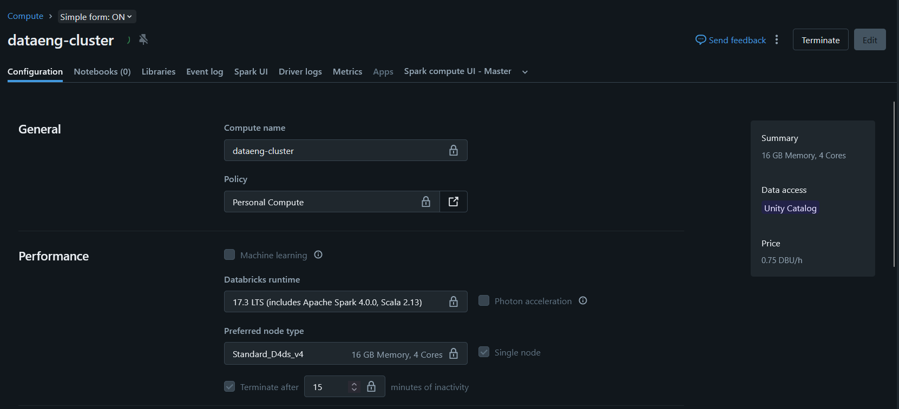
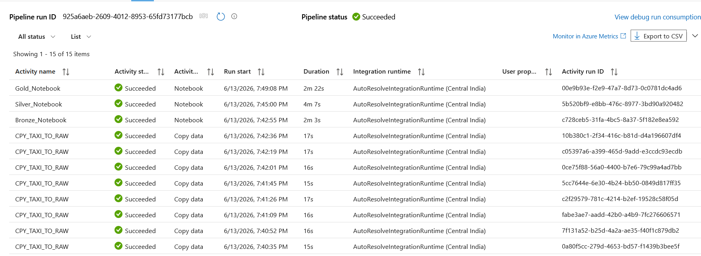
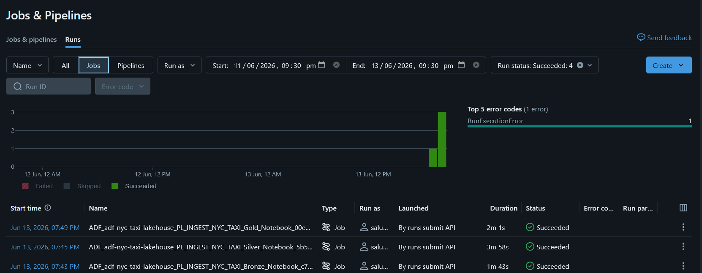

# 🚖 NYC Yellow Taxi — Azure Data Engineering Pipeline

[](https://azure.microsoft.com)
[](https://databricks.com)
[](https://delta.io)
[](https://powerbi.microsoft.com)
[](https://github.com/TejasML/azure-data-engineering-pipeline)
[](https://www.nyc.gov/site/tlc/about/tlc-trip-record-data.page)

> End-to-end cloud data engineering pipeline that ingests, transforms, and models **30M+ NYC Yellow Taxi trip records** using a fully automated, metadata-driven Medallion Architecture on Azure.

---

## 📌 Table of Contents

- [Overview](#-overview)
- [Solution Architecture](#️-solution-architecture)
- [Tech Stack](#️-tech-stack)
- [Pipeline Walkthrough](#-pipeline-walkthrough)
  - [1. Metadata-Driven Ingestion (ADF)](#1-metadata-driven-ingestion-adf)
  - [2. Bronze Layer — Raw Ingestion](#2-bronze-layer--raw-ingestion)
  - [3. Silver Layer — Cleansing & Transformation](#3-silver-layer--cleansing--transformation)
  - [4. Gold Layer — Star Schema Modeling](#4-gold-layer--star-schema-modeling)
- [Databricks SQL & Analytical Queries](#-databricks-sql--analytical-queries)
- [Infrastructure & Security](#-infrastructure--security)
- [Power BI Dashboard](#-power-bi-dashboard)
- [Project Screenshots](#-project-screenshots)
- [Project Structure](#-project-structure)
- [Setup & Reproduction Guide](#-setup--reproduction-guide)
- [Cost Breakdown](#-cost-breakdown)
- [Key Outcomes](#-key-outcomes)
- [Future Enhancements](#-future-enhancements)

---

## 🗺 Overview

This project demonstrates a production-grade **Azure Data Engineering pipeline** built on real-world NYC Yellow Taxi Trip Records. The pipeline automates everything from raw data ingestion to analytical modeling — orchestrated by **Azure Data Factory** and processed through **Azure Databricks** with **Delta Lake** at every layer.

The architecture is **metadata-driven**: a lightweight JSON config controls which monthly datasets are ingested, so the pipeline scales to new months without any code changes. All secrets are managed through **Azure Key Vault** with Databricks Secret Scopes, and all pipeline code is version-controlled via **GitHub integration**.

**Dataset:** [NYC TLC Yellow Taxi Trip Records](https://www.nyc.gov/site/tlc/about/tlc-trip-record-data.page) — monthly Parquet files covering **July 20245– April 2026**, 30M+ rows total.

---

## 🏗️ Solution Architecture


The pipeline flows through four logical stages:

```
REST API (NYC TLC)
      │
      ▼
┌─────────────────────────────────────────┐
│         INGESTION — Azure Data Factory   │
│  months.json ──► Lookup ──► ForEach      │
│                    └──► Copy Activity    │
│                           └──► ADLS Gen2 (raw-landing)
└─────────────────────────────────────────┘
      │
      ▼
┌─────────────────────────────────────────────────────┐
│         MEDALLION ARCHITECTURE — Azure Databricks    │
│                                                      │
│  Raw Landing ──► Bronze ──► Silver ──► Gold          │
│                  (Delta)    (Delta)   (Star Schema)  │
└─────────────────────────────────────────────────────┘
      │
      ▼
┌───────────────────────────────┐
│   Databricks SQL Warehouse    │
│              │                │
│          Power BI             │
└───────────────────────────────┘
```

---

## ⚙️ Tech Stack

| Layer           | Technology                                |
|-----------------|-------------------------------------------|
| Orchestration   | Azure Data Factory (ADF)                  |
| Storage         | Azure Data Lake Storage Gen2 (ADLS Gen2)  |
| Compute         | Azure Databricks (Runtime 17.3 LTS)       |
| Processing      | Apache Spark / PySpark                    |
| Table Format    | Delta Lake                                |
| Analytics       | Databricks SQL Warehouse                  |
| Security        | Azure Key Vault + Databricks Secret Scope |
| Reporting       | Power BI (DirectQuery / Import)           |
| Version Control | GitHub (ADF Git Integration)              |
| Config Format   | JSON (metadata-driven)                    |

---

## 🔄 Pipeline Walkthrough

### 1. Metadata-Driven Ingestion (ADF)

Instead of hardcoding file paths, the pipeline reads a `months.json` configuration file stored in ADLS Gen2. ADF dynamically resolves source URLs and downloads the corresponding NYC Taxi Parquet files — no pipeline changes needed to add new months.

```json
[
  { "year": "2025", "month": "07" },
  { "year": "2025", "month": "08" },
  ...
  { "year": "2026", "month": "04" }
]
```

**ADF Pipeline Activities:**

| Step | Activity          | Description                                              |
|------|-------------------|----------------------------------------------------------|
| 1    | Lookup            | Reads `months.json` from ADLS Gen2                       |
| 2    | ForEach           | Iterates over each year/month entry                      |
| 3    | Copy Activity     | Downloads Parquet via HTTP; lands in `raw-landing`       |
| 4    | Databricks Bronze | Triggers bronze ingestion notebook via Databricks Job    |
| 5    | Databricks Silver | Triggers silver transformation notebook                  |
| 6    | Databricks Gold   | Triggers gold modeling notebook                          |

**Linked Services configured:**

- `LS_NYC_TAXI_SOURCE` — HTTP connection to NYC TLC public data
- `LS_ADLS_GEN2` — Azure Data Lake Storage Gen2
- `LS_AZURE_DATABRICKS` — ADF → Databricks job trigger

> All linked service credentials are pulled securely from **Azure Key Vault** — no secrets in code.


---

### 2. Bronze Layer — Raw Ingestion

The Bronze layer is the raw historical store. Data is ingested as-is from the landing zone and written to Delta tables with no schema changes, preserving full data fidelity.

**Tables created:**

- `bronze.yellow_taxi_trips` — raw trip records (30M+ rows)
- `bronze.taxi_zone_lookup` — NYC taxi zone reference data (265 zones)

**Operations:**
- Read raw Parquet from `raw-landing`
- Register as Delta tables partitioned by `pickup_year` and `pickup_month`
- Preserve original schema and all historical records


---

### 3. Silver Layer — Cleansing & Transformation

The Silver layer enforces data quality and enriches the dataset for downstream modeling. Invalid records are filtered out and new features are derived from existing columns.

**Data Quality Filters applied:**

- Removed trips with zero or negative `passenger_count`
- Removed trips with zero or negative `trip_distance`
- Removed trips with invalid or negative `fare_amount` / `total_amount`
- Removed trips with negative `trip_duration`

**Feature Engineering — new columns derived:**

| Feature                 | Description                               |
|-------------------------|-------------------------------------------|
| `pickup_year`           | Extracted from `tpep_pickup_datetime`     |
| `pickup_month`          | Extracted from `tpep_pickup_datetime`     |
| `pickup_day`            | Extracted from `tpep_pickup_datetime`     |
| `pickup_hour`           | Extracted from `tpep_pickup_datetime`     |
| `trip_duration_minutes` | Calculated from pickup/dropoff timestamps |

**Lookup Enrichment** — Taxi Zone lookup joined to produce:

- `pickup_borough`, `pickup_zone`, `pickup_service_zone`
- `dropoff_borough`, `dropoff_zone`, `dropoff_service_zone`


---

### 4. Gold Layer — Star Schema Modeling

The Gold layer is optimized for analytical workloads and BI reporting, modeled as a Star Schema. Delta tables are Z-ordered and vacuumed for optimal query performance.


#### Dimension Tables

| Table              | Description                                            |
|--------------------|--------------------------------------------------------|
| `dim_date`         | Calendar attributes — year, month, day, hour           |
| `dim_pickup_zone`  | Pickup location details — borough, zone, service zone  |
| `dim_dropoff_zone` | Dropoff location details — borough, zone, service zone |
| `dim_payment_type` | Payment code to description mapping                    |

#### Fact Table

**`fact_trips`** — one row per trip, containing:

- `date_key` → FK to `dim_date`
- `pickup_zone_key` → FK to `dim_pickup_zone`
- `dropoff_zone_key` → FK to `dim_dropoff_zone`
- `payment_type_key` → FK to `dim_payment_type`
- Measures: `trip_distance`, `fare_amount`, `tip_amount`, `total_amount`, `passenger_count`, `trip_duration_minutes`

#### Star Schema Diagram

```
               ┌──────────────┐
               │   dim_date   │
               └──────┬───────┘
                      │
┌──────────────────┐  │  ┌───────────────────┐
│  dim_pickup_zone ├──┼──┤  dim_dropoff_zone  │
└──────────────────┘  │  └───────────────────┘
               ┌──────▼───────┐
               │  fact_trips  │
               └──────┬───────┘
                      │
               ┌──────▼───────────┐
               │  dim_payment_type │
               └──────────────────┘
```


---

## 🔍 Databricks SQL & Analytical Queries

On top of the Gold layer, **Databricks SQL Warehouse** is used to run analytical queries that power the Power BI dashboard. SQL scripts are stored in the [`sql/`](sql/) directory.

**Business questions answered:**

- What are the peak hours and days for NYC taxi demand?
- Which pickup boroughs and zones generate the most revenue?
- How do tip rates vary by payment type and time of day?
- What is the average trip duration and fare by pickup zone?
- Which corridors (pickup → dropoff zone pairs) are the most frequent?

**Connection to Power BI:**

```
Gold Layer (Delta Tables)
        │
        ▼
Databricks SQL Warehouse
        │
        ▼
Power BI (DirectQuery / Import)
```

Databricks SQL Warehouse provides a serverless, auto-scaling compute layer so Power BI queries run directly against the Gold Delta tables without a separate data export step.


---

## 🔐 Infrastructure & Security

### ADLS Gen2 Container Structure

```
adls-account/
├── raw-landing/   # Source Parquet files (as-received from NYC TLC)
├── bronze/        # Delta tables — raw ingested data
├── silver/        # Delta tables — cleansed & enriched
└── gold/          # Delta tables — star schema (fact + dims)
```

### Azure Key Vault + Databricks Secret Scope

All credentials (storage account keys, connection strings, SAS tokens) are stored in **Azure Key Vault** and accessed from Databricks notebooks via a **Secret Scope** — no hardcoded secrets anywhere in the codebase.

```python
# Example — secrets accessed securely in notebooks
storage_account_key = dbutils.secrets.get(scope="kv-scope", key="adls-account-key")
```

Benefits:
- Centralized credential management
- Easy secret rotation without notebook changes
- Audit trail and access control via Azure RBAC

### Databricks Cluster Configuration

| Property         | Value                        |
|------------------|------------------------------|
| Runtime          | Databricks Runtime 17.3 LTS  |
| Node Type        | Standard_D4ds_v4             |
| Memory           | 16 GB RAM, 4 vCores          |
| Mode             | Single Node                  |
| Auto-termination | 15 minutes (idle)            |
| Unity Catalog    | Enabled                      |

### ADF Git Integration

Azure Data Factory is integrated with this GitHub repository for source control. All pipelines, datasets, linked services, and factory configurations are versioned — enabling change tracking, rollback, and reproducible deployments.



---

## 📊 Power BI Dashboard

Power BI connects directly to the **Databricks SQL Warehouse** (no export needed) and reports over the Gold layer Star Schema.

**Dashboard Pages:**

| Page                       | Focus                                             |
|----------------------------|---------------------------------------------------|
| Executive Overview         | High-level KPIs — total trips, revenue, avg fare  |
| Trip Analysis              | Temporal patterns — hour, day, month trends       |
| Revenue Analysis           | Fare breakdown, tip rates, surge patterns         |
| Payment Analysis           | Payment type distribution and trends              |
| Pickup & Dropoff Insights  | Zone-level heatmaps and top corridors             |


---

## 📸 Project Screenshots

### Azure Data Factory — Pipeline



### Databricks — Job Run & Workflow



### Databricks — Spark UI Execution Plan


### Power BI — Revenue Analysis


---

## 📁 Project Structure

```
azure-data-engineering-pipeline/
│
├── README.md
│
├── architecture/
│   ├── solution_architecture.png     # Full solution architecture diagram
│   ├── medallion_architecture.png    # Medallion layer diagram
│   └── star_schema.png              # Star schema data model
│
├── azure-data-factory/
│   ├── dataset/                      # ADF dataset definitions
│   ├── factory/                      # Factory-level configuration
│   ├── linkedService/                # Linked service definitions
│   └── pipeline/                     # Pipeline JSON definitions
│
├── config/
│   └── months.json                   # Metadata config — controls which months to ingest
│
├── databricks/
│   ├── 01_bronze_ingestion.py        # Raw landing → Bronze Delta
│   ├── 02_silver_transformation.py   # Bronze → Silver (cleansing + enrichment)
│   └── 03_gold_modeling.py           # Silver → Gold (star schema)
│
├── sql/
│   └── nyc_taxi_queries.sql          # Analytical SQL queries on Gold layer
│
└── project-assets/
    ├── adf/                          # ADF pipeline & run screenshots
    ├── databricks/                   # Notebook, cluster, job & Spark UI screenshots
    ├── powerbi/                      # Dashboard screenshots
    └── cost_analysis.png             # Azure cost breakdown screenshot
```

---

## 💰 Cost Breakdown

Developed and tested on **Azure for Students** credits (₹1,269.56 total).

| Service              | Approx. Cost  | Notes                                |
|----------------------|---------------|--------------------------------------|
| Azure Databricks     | ₹620          | Compute for Bronze/Silver/Gold runs  |
| NAT Gateway          | ₹390          | Required for Databricks VNet egress  |
| Virtual Machines     | ₹180          | Databricks cluster nodes             |
| Azure Data Factory   | ₹50           | Pipeline activity runs               |
| ADLS Gen2 + Network  | ₹29.56        | Storage and VNet overhead            |
| **Total**            | **₹1,269.56** |                                      |

**Cost optimizations applied:**

- Used a single-node Databricks cluster to minimize DBU consumption during development.
- Configured cluster auto-termination after 15 minutes of inactivity to prevent unnecessary compute charges.
- Used metadata-driven ingestion (`months.json`) to avoid creating multiple pipelines for each month, reducing maintenance overhead.
- Leveraged Azure Data Factory orchestration instead of keeping compute resources continuously running.
- Monitored Azure resource consumption using Azure Cost Analysis to track and optimize project spending.


---

## 🎯 Key Outcomes

| Metric                         | Result                                              |
|--------------------------------|-----------------------------------------------------|
| Records processed              | 30M+ NYC Yellow Taxi trip records                   |
| Data layers built              | 4 (Raw Landing, Bronze, Silver, Gold)               |
| Dimension tables               | 4 (`dim_date`, `dim_pickup_zone`, `dim_dropoff_zone`, `dim_payment_type`) |
| Fact table                     | 1 (`fact_trips`)                                    |
| Dashboard pages                | 5 (Executive, Trip, Revenue, Payment, Zone)         |
| Security                       | Zero hardcoded secrets — 100% Key Vault managed     |
| Pipeline design                | Metadata-driven — add new months via config only    |
| Storage format                 | Delta Lake throughout (ACID, time travel enabled)   |

**Skills demonstrated through this project:**

- Designing and deploying end-to-end cloud data pipelines on Azure
- Building metadata-driven ADF pipelines with Lookup + ForEach patterns
- Implementing Medallion Architecture (Bronze / Silver / Gold) with Delta Lake
- Writing PySpark transformation logic for large-scale datasets (30M+ records)
- Modeling analytical schemas (Star Schema) for BI consumption
- Securing cloud workloads with Azure Key Vault and Databricks Secret Scopes
- Integrating Databricks SQL Warehouse with Power BI for live reporting
- Managing and optimizing cloud infrastructure costs

---

## 🚀 Future Enhancements

- Implement Incremental Loading using Delta Lake `MERGE` operations to support efficient data refreshes and reduce processing costs.
- Add Structured Streaming for near real-time ingestion and processing of taxi trip data.
- Implement Slowly Changing Dimensions (SCD Type 2) for historical tracking of dimensional data.
- Configure Azure Monitor alerts for automated pipeline failure notifications and operational monitoring.
- Integrate additional NYC Taxi datasets (Green Taxi and FHV) for broader transportation analytics.
- Optimize Delta Lake tables using partitioning and performance tuning techniques.
- Enhance Power BI dashboards with advanced KPI tracking and executive-level analytics.
- Implement a CI/CD workflow using GitHub Actions for automated deployment and version control.

  
---

<div align="center">

Built with ☁️ on Azure &nbsp;|&nbsp; [NYC TLC Open Data](https://www.nyc.gov/site/tlc/about/tlc-trip-record-data.page) &nbsp;|&nbsp; Delta Lake + Databricks

</div>
