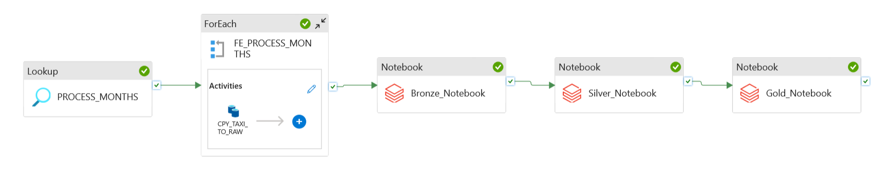
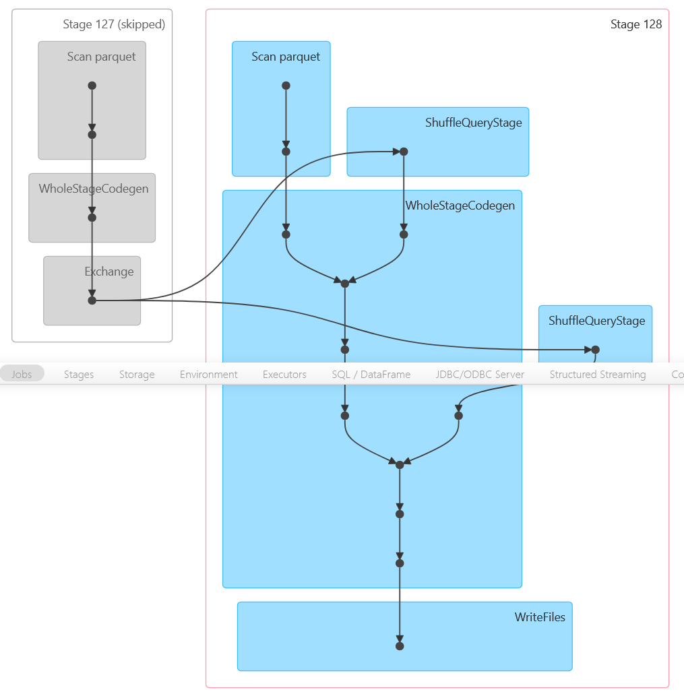
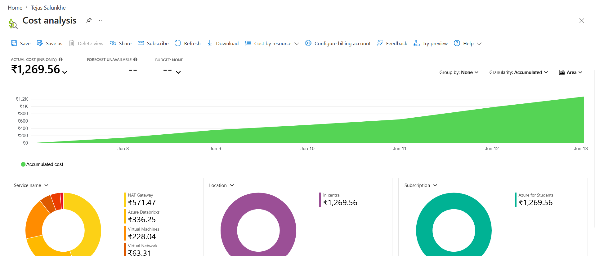

# 🚖 NYC Yellow Taxi — Azure Data Engineering Pipeline

[](https://azure.microsoft.com)
[](https://databricks.com)
[](https://delta.io)
[](https://powerbi.microsoft.com)
[](https://github.com/TejasML/azure-data-engineering-pipeline)

> End-to-end cloud data engineering pipeline that ingests, transforms, and models **36M+ NYC Yellow Taxi trip records** using a fully automated, metadata-driven Medallion Architecture on Azure — built for scale, cost-efficiency, and BI-ready output.

---

## 📌 Table of Contents

- [Overview](#-overview)
- [Architecture](#️-architecture)
- [Tech Stack](#️-tech-stack)
- [Pipeline Walkthrough](#-pipeline-walkthrough)
  - [1. Metadata-Driven Ingestion (ADF)](#1-metadata-driven-ingestion-adf)
  - [2. Bronze Layer — Raw Ingestion](#2-bronze-layer--raw-ingestion)
  - [3. Silver Layer — Cleansing & Transformation](#3-silver-layer--cleansing--transformation)
  - [4. Gold Layer — Star Schema Modeling](#4-gold-layer--star-schema-modeling)
- [Infrastructure & Security](#-infrastructure--security)
- [Power BI Dashboard](#-power-bi-dashboard)
- [Project Structure](#-project-structure)
- [Cost Analysis & Optimization](#-cost-analysis--optimization)
- [Key Outcomes](#-key-outcomes)
- [Future Enhancements](#-future-enhancements)

---

## 🗺 Overview

This project demonstrates a **production-grade Azure Data Engineering pipeline** processing real-world NYC Yellow Taxi Trip Records from the NYC Taxi & Limousine Commission (TLC). The pipeline handles the full data lifecycle — from raw HTTP ingestion through analytical modeling — without a single manual step.

**What makes this pipeline production-grade:**

- **Metadata-driven orchestration** — a `months.json` config file controls which datasets are ingested. Adding a new month requires zero code changes; just update the config.
- **Medallion Architecture** — data flows through three validated layers (Bronze → Silver → Gold), each serving a distinct purpose with clear quality contracts.
- **Incremental by design** — ADF ForEach loops process each monthly file independently, making the pipeline naturally restartable and resumable on failure.
- **Security-first** — no credentials are hardcoded anywhere. All secrets live in Azure Key Vault, accessed via Databricks Secret Scope.
- **Cost-optimized** — processed 36M+ records for under ₹1,300 (~$15 USD) using deliberate infrastructure choices.

**Dataset:** [NYC TLC Yellow Taxi Trip Records](https://www.nyc.gov/site/tlc/about/tlc-trip-record-data.page)
Monthly Parquet files | **36M+ rows** | Schema: 19 columns including timestamps, coordinates, fares, tips, and payment types

---

## 🏗️ Architecture


The architecture follows a classic **ELT pattern on Azure**: raw data lands in ADLS Gen2, then Databricks transforms it in-place through the medallion layers. ADF acts purely as the orchestrator — it triggers Databricks notebooks but does not process data itself, keeping compute costs isolated to Databricks where it can be tightly controlled.

**Data flow at a glance:**

```
NYC TLC (HTTP)
      │
      ▼
ADF: Lookup months.json → ForEach → Copy Activity
      │
      ▼
ADLS Gen2: raw-landing/   ← Parquet files land here
      │
      ▼  [Databricks Notebook 01]
ADLS Gen2: bronze/        ← Delta tables, schema preserved, no filtering
      │
      ▼  [Databricks Notebook 02]
ADLS Gen2: silver/        ← Delta tables, DQ validated, features engineered
      │
      ▼  [Databricks Notebook 03]
ADLS Gen2: gold/          ← Star schema (fact + 4 dims), BI-ready
      │
      ▼
Databricks SQL Warehouse → Power BI (DirectQuery)
```

---

## ⚙️ Tech Stack

| Layer           | Technology                                  | Purpose                                        |
| --------------- | ------------------------------------------- | ---------------------------------------------- |
| Orchestration   | Azure Data Factory (ADF)                    | Pipeline scheduling, metadata-driven triggering |
| Storage         | Azure Data Lake Storage Gen2 (ADLS Gen2)    | Hierarchical namespace for medallion layers     |
| Compute         | Azure Databricks (Runtime 17.3 LTS)         | Distributed PySpark processing                 |
| Processing      | Apache Spark / PySpark                      | Large-scale data transformation                |
| Table Format    | Delta Lake                                  | ACID transactions, time travel, schema enforcement |
| Security        | Azure Key Vault + Databricks Secret Scope   | Zero-secret codebase                           |
| Reporting       | Power BI → Databricks SQL Warehouse         | Live DirectQuery over Gold layer               |
| Version Control | GitHub                                      | Pipeline JSON, notebooks, config               |
| Config          | JSON (metadata-driven)                      | Month-level ingestion control                  |

---

## 🔄 Pipeline Walkthrough

### 1. Metadata-Driven Ingestion (ADF)



The pipeline is controlled by a small config file (`config/months.json`) stored in ADLS Gen2. ADF reads this file at runtime using a **Lookup activity**, then fans out across each entry using a **ForEach activity** — each iteration downloads one monthly Parquet file via HTTP and lands it in `raw-landing/`.

```json
[
  { "year": "2024", "month": "01" },
  { "year": "2024", "month": "02" },
  ...
]
```

**Why metadata-driven?** Without this pattern, adding a new month means editing the pipeline definition. With it, ingestion is a config change — the pipeline logic never needs to be touched. This also makes the pipeline easily adaptable to other TLC dataset types (Green Taxi, FHV) with minimal modification.

**Pipeline activity chain:**

| Step | Activity             | Detail                                                             |
| ---- | -------------------- | ------------------------------------------------------------------ |
| 1    | Lookup               | Reads `months.json` → returns array of `{year, month}` objects     |
| 2    | ForEach              | Iterates over each entry in parallel (configurable concurrency)    |
| 3    | Copy Activity        | HTTP GET from NYC TLC → Parquet file written to `raw-landing/`    |
| 4    | Notebook: Bronze     | ADF triggers `01_bronze_ingestion.ipynb` via Databricks linked service |
| 5    | Notebook: Silver     | ADF triggers `02_silver_transformation.ipynb`                      |
| 6    | Notebook: Gold       | ADF triggers `03_gold_transformation.ipynb`                        |

**Linked services configured in ADF:**
- `LS_NYC_TAXI_SOURCE` — HTTP dataset pointing to the NYC TLC public Parquet endpoint
- `LS_ADLS_GEN2` — ADLS Gen2 with account key retrieved from Key Vault at runtime
- `LS_AZURE_DATABRICKS` — MSI-authenticated connection to the Databricks workspace

---

### 2. Bronze Layer — Raw Ingestion

The Bronze layer is the **immutable raw store** — data is written exactly as received from the source, with no filtering, casting, or business logic applied. This is a deliberate design choice: if upstream schema changes or a data quality issue is discovered later, the original data is always available for re-processing.

**Notebook:** `databricks/01_bronze_ingestion.ipynb`

**What the notebook does:**
1. Reads raw Parquet from `raw-landing/yellow_tripdata_{year}_{month}.parquet`
2. Appends to `bronze.yellow_taxi_trips` as a Delta table (schema merge enabled)
3. Reads the static taxi zone CSV from ADLS and registers `bronze.taxi_zone_lookup`
4. Logs row count and file metadata for lineage tracking

**Bronze Delta tables:**

| Table                      | Rows (approx.) | Description                              |
| -------------------------- | -------------- | ---------------------------------------- |
| `bronze.yellow_taxi_trips` | 36M+           | Raw trip records, all months combined    |
| `bronze.taxi_zone_lookup`  | 265            | NYC zone → borough/service zone mapping  |

**Key design decision:** Delta Lake is used even at the Bronze layer (not raw Parquet) because it gives ACID guarantees on appends — if the ADF pipeline fails mid-run and retries, duplicate data cannot be introduced.

---

### 3. Silver Layer — Cleansing & Transformation

The Silver layer applies **data quality rules and business-level enrichment**. Only records that pass all quality gates are promoted to Silver — making this the first layer that downstream analysts can trust for accurate metrics.

**Notebook:** `databricks/02_silver_transformation.ipynb`

**Spark Execution Plan:**



The execution plan above shows how Spark physically executes the Silver transformation at scale — filter predicates are pushed down before the shuffle, the zone lookup join is broadcast (265-row table), and writes are partitioned by `pickup_year` and `pickup_month` for downstream query pruning.

**Data quality filters applied (with business rationale):**

| Filter                                   | Reason                                                           |
| ---------------------------------------- | ---------------------------------------------------------------- |
| `passenger_count > 0`                    | A trip with zero passengers is a data entry error                |
| `trip_distance > 0`                      | Zero-distance trips indicate meter malfunctions or test records  |
| `fare_amount > 0 AND total_amount > 0`   | Negative fares are refund/adjustment records, not actual trips   |
| `trip_duration_minutes > 0`              | Dropoff before pickup — timestamp corruption                     |
| `pickup_datetime < dropoff_datetime`     | Guards against inverted timestamp entries                        |

**Feature engineering — derived columns:**

| New Column              | Derived From                  | Use in Analysis                     |
| ----------------------- | ----------------------------- | ----------------------------------- |
| `pickup_year`           | `tpep_pickup_datetime`        | Year-over-year trend analysis       |
| `pickup_month`          | `tpep_pickup_datetime`        | Seasonality patterns                |
| `pickup_day`            | `tpep_pickup_datetime`        | Day-of-week demand analysis         |
| `pickup_hour`           | `tpep_pickup_datetime`        | Rush hour identification            |
| `trip_duration_minutes` | dropoff − pickup timestamps   | Speed, efficiency, and fare/min KPIs |

**Zone enrichment** — `bronze.taxi_zone_lookup` is broadcast-joined to produce:
- `pickup_borough`, `pickup_zone`, `pickup_service_zone`
- `dropoff_borough`, `dropoff_zone`, `dropoff_service_zone`

This enrichment enables borough-level and corridor-level analysis in Power BI without any joins at query time.

---

### 4. Gold Layer — Star Schema Modeling

The Gold layer is the **analytical serving layer**, structured as a Star Schema optimized for Power BI DirectQuery performance. Every dimension is pre-joined and deduplicated; `fact_trips` contains only foreign keys and numeric measures.

**Notebook:** `databricks/03_gold_transformation.ipynb`

**Star Schema:**


#### Dimension Tables

| Table              | Grain                   | Key Columns                                     |
| ------------------ | ----------------------- | ----------------------------------------------- |
| `dim_date`         | One row per hour        | `date_key`, `year`, `month`, `day`, `hour`, `day_of_week` |
| `dim_pickup_zone`  | One row per taxi zone   | `pickup_zone_key`, `zone`, `borough`, `service_zone` |
| `dim_dropoff_zone` | One row per taxi zone   | `dropoff_zone_key`, `zone`, `borough`, `service_zone` |
| `dim_payment_type` | One row per payment code| `payment_type_key`, `payment_description`       |

#### Fact Table — `fact_trips`

One row per taxi trip. All dimension lookups are pre-resolved to surrogate keys, so Power BI never needs to join raw strings at query time.

| Column                | Type    | Description                          |
| --------------------- | ------- | ------------------------------------ |
| `date_key`            | FK      | → `dim_date`                         |
| `pickup_zone_key`     | FK      | → `dim_pickup_zone`                  |
| `dropoff_zone_key`    | FK      | → `dim_dropoff_zone`                 |
| `payment_type_key`    | FK      | → `dim_payment_type`                 |
| `passenger_count`     | Measure | Number of passengers                 |
| `trip_distance`       | Measure | Miles traveled                       |
| `fare_amount`         | Measure | Base fare (before tips/surcharges)   |
| `tip_amount`          | Measure | Tip paid                             |
| `total_amount`        | Measure | Total charged to passenger           |
| `trip_duration_minutes` | Measure | Calculated trip duration           |


---

## 🔐 Infrastructure & Security

### ADLS Gen2 Storage Layout

```
adls-account/
├── raw-landing/        # Parquet files as downloaded from NYC TLC HTTP endpoint
│   └── yellow_tripdata_2024_01.parquet
│   └── yellow_tripdata_2024_02.parquet
│   └── ...
├── bronze/             # Delta tables — raw, schema-preserved
│   └── yellow_taxi_trips/
│   └── taxi_zone_lookup/
├── silver/             # Delta tables — DQ-validated, partitioned, enriched
│   └── yellow_taxi_trips/
└── gold/               # Delta tables — star schema, BI-optimized
    └── fact_trips/
    └── dim_date/
    └── dim_pickup_zone/
    └── dim_dropoff_zone/
    └── dim_payment_type/
```

### Security Architecture

All credentials follow a **zero-secret-in-code** pattern:

```
Azure Key Vault
      │
      │  (Databricks Secret Scope backed by Key Vault)
      ▼
Databricks Notebooks
  dbutils.secrets.get(scope="kv-scope", key="adls-account-key")
```

- Storage account key → stored in Key Vault, fetched via Secret Scope at notebook runtime
- No `.env` files, no hardcoded connection strings, no credentials in Git history
- Azure RBAC controls which identities can read Key Vault secrets

### Databricks Cluster

| Property         | Value                    | Cost Impact                                |
| ---------------- | ------------------------ | ------------------------------------------ |
| Runtime          | DBR 17.3 LTS             | LTS = stable, no upgrade churn             |
| Node Type        | Standard_D4ds_v4         | 16 GB RAM, 4 vCores — sufficient for 36M rows |
| Mode             | Single Node              | Eliminates driver + worker split overhead  |
| Auto-termination | 15 minutes               | Cluster shuts down immediately after job   |
| Unity Catalog    | Enabled                  | Fine-grained table-level access control    |

---

## 📊 Power BI Dashboard

Power BI connects to the Gold layer via **Databricks SQL Warehouse** using DirectQuery — the data never leaves Azure, and reports always reflect the latest pipeline run.

**Connection architecture:**
```
fact_trips + dim_* (Gold Delta Tables)
          │
          ▼
  Databricks SQL Warehouse
  (auto-starts on query, auto-stops on idle)
          │
          ▼
  Power BI Desktop / Power BI Service
  (DirectQuery — no data extract needed)
```

**Dashboard pages planned:**

| Page                      | Key Metrics                                                 |
| ------------------------- | ----------------------------------------------------------- |
| Executive Overview        | Total trips, total revenue, avg fare, avg tip rate          |
| Temporal Analysis         | Trips by hour, day-of-week demand heatmap, monthly trends   |
| Revenue Breakdown         | Fare vs tip vs surcharge split, high-revenue zones          |
| Payment Analysis          | Payment type share over time, cash vs card trends           |
| Zone Intelligence         | Top pickup/dropoff corridors, borough-level flow maps       |

> 📌 Power BI `.pbix` file and dashboard screenshots will be added in a future update.

---

## 📁 Project Structure

```
azure-data-engineering-pipeline/
│
├── README.md
│
├── architecture/
│   ├── solution_architecture.png       # Full end-to-end architecture diagram
│   └── star_schema.png                 # Gold layer star schema (fact + 4 dims)
│
├── azure-data-factory/
│   ├── dataset/                        # ADF dataset JSON definitions (HTTP source, ADLS sink)
│   ├── factory/                        # Factory-level global settings
│   ├── linkedService/                  # LS_NYC_TAXI_SOURCE, LS_ADLS_GEN2, LS_AZURE_DATABRICKS
│   ├── pipeline/                       # Pipeline JSON — Lookup + ForEach + Copy + Notebook activities
│   └── publish_config.json             # ADF publish/deploy configuration
│
├── config/
│   └── months.json                     # Ingestion control — list of {year, month} to process
│
├── databricks/
│   ├── 01_bronze_ingestion.ipynb       # Parquet → Bronze Delta (raw, append-only)
│   ├── 02_silver_transformation.ipynb  # Bronze → Silver (DQ filters, feature engineering)
│   └── 03_gold_transformation.ipynb    # Silver → Gold (star schema, OPTIMIZE, ZORDER)
│
├── sql/
│   └── nyc_taxi_queries.sql            # Analytical queries on the Gold layer for validation
│
└── project-assets/
    ├── adf/
    │   ├── adf_pipeline.png            # ADF pipeline canvas — activity chain
    │   ├── adf_monitor_success.png     # Monitor view — successful pipeline run history
    │   ├── linked_services.png         # Three configured linked services
    │   ├── resource_group.png          # Azure resource group — all provisioned services
    │   ├── storage_containers.png      # ADLS Gen2 four-container medallion layout
    │   └── project_cost_analysis.png   # Azure cost breakdown by service
    ├── databricks/
    │   ├── databricks_workspace.png    # Workspace with medallion notebooks
    │   ├── cluster.png                 # Single-node cluster configuration
    │   ├── Job.png                     # Databricks Job triggered by ADF
    │   └── silver_layer_execution_plan.png  # Spark physical plan for Silver transformation
    └── powerbi/                        # Power BI dashboard screenshots (coming soon)
```

---

## 💰 Cost Analysis & Optimization



**Total project spend: ₹1,269.56 (~$15 USD)** — processing 36M+ records across a full multi-month pipeline run on Azure for Students credits.

### Cost Breakdown

| Service | Cost | Notes |
| ------------------------ | ------------- | ------------------------------------------------------ |
| NAT Gateway | ₹571.47 | Outbound internet for HTTP downloads from NYC TLC |
| Azure Databricks | ₹336.25 | Spark compute for Bronze/Silver/Gold transformations |
| Virtual Machines | ₹228.04 | Underlying VM for Databricks single-node cluster |
| Virtual Network | ₹63.31 | Network infrastructure for resource communication |
| ADLS Gen2 Storage | ₹53.09 | Storage of raw Parquet + Delta tables across 4 layers |
| Azure Data Factory v2 | ₹17.38 | Pipeline runs, activity executions + secret reads |
| **Total** | **₹1,269.54** | |

### Cost Optimization Decisions

Every infrastructure choice in this project was made with cost in mind alongside functionality:

**1. Single-Node Databricks Cluster**
Using a `Standard_D4ds_v4` single-node cluster instead of a multi-node cluster eliminates the driver/worker VM split. For a dataset of this size (36M rows), a single node with 16 GB RAM and 4 vCores processes Silver and Gold transformations efficiently using local Spark mode. This alone reduces Databricks cost by ~50% vs a 2-node setup.

**2. 15-Minute Auto-Termination**
The cluster shuts down automatically after 15 minutes of inactivity. Since ADF triggers notebooks sequentially (Bronze → Silver → Gold), the cluster stays active only during active processing and terminates immediately after the Gold notebook completes. No idle compute billing.

**3. Broadcast Join for Zone Lookup**
The `taxi_zone_lookup` table (265 rows) is broadcast to all Spark executors during the Silver enrichment join. This avoids a shuffle join (which would require data redistribution across nodes), reducing both execution time and any network egress that would otherwise occur.

**4. Partitioned Writes in Silver and Gold**
Silver and Gold Delta tables are partitioned by `pickup_year` and `pickup_month`. Power BI date-filtered queries only scan the relevant partitions — reducing SQL Warehouse scan cost and query latency.

**5. ADF Metadata-Driven Pattern (vs Hardcoded Pipelines)**
Running one parameterized pipeline instead of N individual pipelines means fewer ADF activity execution charges and zero duplicated pipeline management overhead.

**6. NAT Gateway (Identified Cost Driver)**
The NAT Gateway was the largest single cost contributor — required for Databricks clusters in a private VNet to reach the public internet (for NYC TLC HTTP downloads). In a cost-optimized production setup, this would be replaced with an **Azure Private Endpoint** for ADLS and a **Service Endpoint** for ADF, eliminating the NAT Gateway entirely for most traffic.

---

## 🎯 Key Outcomes

**Technical skills demonstrated:**

- End-to-end pipeline design on Azure — from HTTP source to BI layer
- Metadata-driven ADF orchestration using Lookup + ForEach patterns
- Medallion Architecture with Delta Lake ACID guarantees at every layer
- PySpark transformation logic at 36M+ row scale — DQ, feature engineering, star schema modeling
- Broadcast join optimization, predicate pushdown, partition pruning
- Security architecture using Azure Key Vault + Databricks Secret Scope
- Power BI integration via Databricks SQL Warehouse (DirectQuery)
- Cloud cost management — ₹1,269.56 total for a full multi-month pipeline run

**Data engineering principles applied:**

- **Separation of concerns** — ADF orchestrates, Databricks computes, ADLS stores; no mixing of roles
- **Idempotency** — every notebook can be re-run safely; Delta's transaction log prevents duplicate writes
- **Schema evolution** — Bronze uses `mergeSchema=True` so new TLC columns don't break the pipeline
- **Data lineage** — raw data is always preserved in Bronze; Silver and Gold are always reproducible

---

## 🚀 Future Enhancements

- [ ] **Incremental loading** — Delta `MERGE` (upsert) instead of full monthly overwrites
- [ ] **Structured Streaming** — near-real-time ingestion from TLC live feed
- [ ] **SCD Type 2** — track zone name/borough changes in dimension tables over time
- [ ] **CI/CD** — GitHub Actions to validate ADF JSON and run Databricks notebook tests on PR
- [ ] **Data quality framework** — replace manual filters with Great Expectations or Databricks DQ
- [ ] **Multi-dataset expansion** — Green Taxi and FHV datasets using the same pipeline pattern
- [ ] **Replace NAT Gateway** — use Private Endpoints to eliminate the largest cost driver
- [ ] **Power BI dashboard** — publish `.pbix` and add screenshots to `project-assets/powerbi/`
- [ ] **Production deployment** — move from Azure for Students to a proper Azure subscription with RBAC policies

---

Built with ☁️ on Azure | [NYC TLC Open Data](https://www.nyc.gov/site/tlc/about/tlc-trip-record-data.page) | Delta Lake + Databricks
ENDOFFILE
